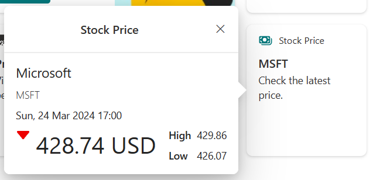

# Stock Price

## Summary

Simple card that leverages the Advance API Features functionality of the Card Designer to display a stock price. It uses a SharePoint list as the backend.

The quick view displays the company name, stock symbol, refresh date, latest price, highest price and lowest price.

The card is designed to display a single stock and therefore only displays the first list item (this could easily be updated to display multiple stocks).

Updating of the stock price in the list could be automated using a recurring Power Automate flow and a Stocks API.

## Contributors
- [Alex Clark](https://github.com/alexc-msft)

## Version history

Version|Date|Comments
-------|----|--------
1.0|March 24, 2024|Initial release

## Tags

- Stock

## Category

Financial